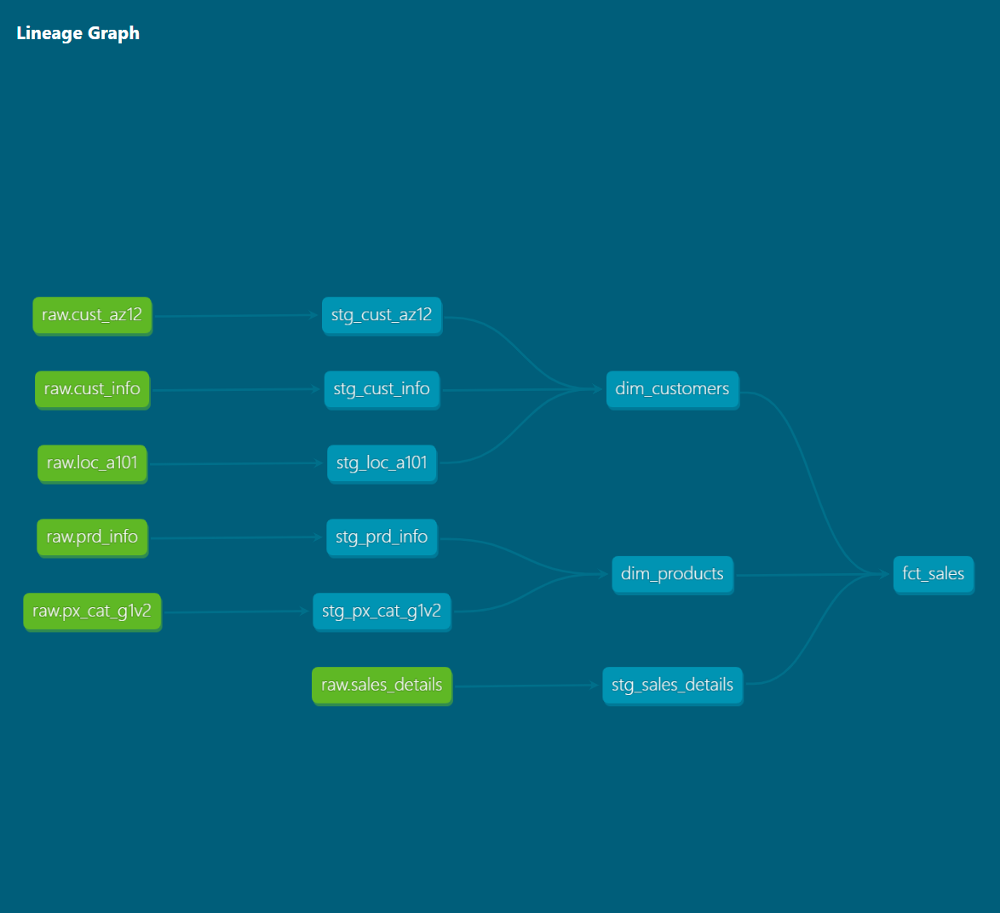

# Sales Data Warehouse

**Personal Project — Florida International University, Updated 2026**

---

## Overview

End-to-end data warehousing project consolidating ERP and CRM sales data into an analytics-ready star schema. Built in two phases: first using SQL Server with medallion architecture and T-SQL stored procedures, then modernized with dbt and Snowflake to demonstrate current analytics engineering practices including incremental loading, schema testing, lineage documentation, and change data capture.

| Source | Tables | Description |
|---|---|---|
| CRM | `crm_cust_info`, `crm_prd_info`, `crm_sales_details` | Customer profiles, product catalog, sales transactions |
| ERP | `erp_cust_az12`, `erp_loc_a101`, `erp_px_cat_g1v2` | Customer demographics, location data, product categories |

---

## Architecture

### Phase 1 — SQL Server (Medallion Architecture)

The warehouse follows Bronze → Silver → Gold medallion architecture. Raw CSVs are ingested into Bronze, cleaned and standardized in Silver via T-SQL stored procedures, and surfaced as a Star Schema in the Gold layer for BI and analytics consumption.


| | 🟫 Bronze | 🥈 Silver | 🥇 Gold |
|---|---|---|---|
| **Definition** | Raw, unprocessed data as-is | Clean & standardized data | Business-ready data |
| **Object Type** | Tables | Tables | Views |
| **Load Method** | Full Load (Truncate & Insert) | Full Load (Truncate & Insert) | None |
| **Transformations** | None | Cleaning, standardization, derived columns | Integration, business logic, Star Schema |
| **Target Audience** | Data Engineers | Data Analysts, Data Engineers | Analysts, Business Users |

### Phase 2 — dbt + Snowflake (Modern Analytics Engineering)

The transformation layer was rebuilt using dbt on Snowflake, replacing T-SQL scripts with modular, tested, documented models:

- 6 raw source tables loaded into Snowflake RAW schema (60,398 sales records, 18,494 customer records, 397 products)
- Silver layer rebuilt as **dbt staging models** with explicit casting, business logic encoding, and null filtering
- Gold layer rebuilt as **dbt mart models** — `dim_customers`, `dim_products`, and an incremental `fct_sales`
- 20 dbt schema tests across sources and models (not_null, unique, accepted_values)
- dbt lineage DAG auto-generated documenting the full raw → staging → marts graph
- Snowflake Streams + Tasks added for change data capture on the sales pipeline



---

## Data Flow


---

## Data Integration


---

## Source Data

| File | Rows | Key Column | Notes |
|---|---|---|---|
| `cust_info.csv` | 18,494 | `cst_id` | 9 duplicate IDs; 4,578 blank gender values |
| `prd_info.csv` | 397 | `prd_id` | 77 duplicate `prd_key` entries (historical versions); 2 blank costs |
| `sales_details.csv` | 60,398 | `sls_ord_num` | 19 invalid order dates; 15 sales/price mismatches; 5 negative prices |
| `CUST_AZ12.csv` | 18,484 | `CID` | `NAS` prefix on all IDs; 1,476 blank gender values; 16 future birthdates |
| `LOC_A101.csv` | 18,484 | `CID` | Dashes in CID; inconsistent country codes (`US`/`USA`, `DE`); 337 blanks |
| `PX_CAT_G1V2.csv` | 37 | `ID` | Clean; 4 categories, 37 subcategories |

---

## Data Quality & Transformations

### crm_cust_info (18,494 raw rows)

| Issue | Count | Resolution |
|---|---|---|
| Duplicate `cst_id` records | 9 IDs | `ROW_NUMBER() OVER (PARTITION BY cst_id ORDER BY cst_create_date DESC)` — most recent kept |
| Null `cst_id` rows | 4 | Filtered with `WHERE cst_id IS NOT NULL` |
| Whitespace on names | Present | `TRIM()` on `cst_firstname` and `cst_lastname` |
| Marital status coded (`M`/`S`) | 7 blanks | `'M'` → `'Married'`, `'S'` → `'Single'`, else `'n/a'` |
| Gender coded (`M`/`F`) | 4,578 blanks | `'M'` → `'Male'`, `'F'` → `'Female'`, else `'n/a'` |

### crm_prd_info (397 raw rows)

| Issue | Count | Resolution |
|---|---|---|
| Duplicate `prd_key` (historical versions) | 197 rows with non-null `prd_end_dt` | `prd_end_dt` derived via `LEAD()`; Gold filters `WHERE prd_end_dt IS NULL` for current records |
| Null `prd_cost` | 2 | `ISNULL(prd_cost, 0)` |
| Product line coded (`M`/`R`/`S`/`T`) | 17 blanks | Decoded to `Mountain`, `Road`, `Touring`, `Other Sales`, else `'n/a'` |

### crm_sales_details (60,398 raw rows)

| Issue | Count | Resolution |
|---|---|---|
| Order dates as integers (YYYYMMDD) | All rows | Validated `LEN() = 8 AND value != 0`, cast to `DATE`; 19 invalid → `NULL` |
| `sls_sales` missing or inconsistent | 15 + 8 nulls | Recalculated as `sls_quantity × ABS(sls_price)` when null, zero, or mismatched |
| Negative `sls_price` | 5 | `ABS(sls_price)` applied |

### erp_cust_az12 (18,484 raw rows)

| Issue | Count | Resolution |
|---|---|---|
| `NAS` prefix on all `CID` values | All rows | Stripped with `SUBSTRING(cid, 4, LEN(cid))` |
| Future birthdates | 16 | Set to `NULL` |
| Inconsistent gender codes | 1,476 blanks | Normalized to `Male`, `Female`, `n/a` |

### erp_loc_a101 (18,484 raw rows)

| Issue | Count | Resolution |
|---|---|---|
| Dashes in `CID` | All rows | `REPLACE(cid, '-', '')` |
| Inconsistent country codes | `USA`/`US`, `DE`, 337 blanks | `'DE'` → `'Germany'`, `'US'`/`'USA'` → `'United States'`, blank → `'n/a'` |

### erp_px_cat_g1v2 (37 raw rows)

No issues found — pass-through load.

---

## Data Model (Star Schema)


### gold.dim_customers

| Column | Type | Description |
|---|---|---|
| customer_key | INT | Surrogate key (PK) |
| customer_id | INT | Source system customer ID |
| customer_number | NVARCHAR(50) | Alphanumeric customer reference |
| first_name | NVARCHAR(50) | Customer first name |
| last_name | NVARCHAR(50) | Customer last name |
| country | NVARCHAR(50) | Country of residence |
| marital_status | NVARCHAR(50) | `Married` or `Single` |
| gender | NVARCHAR(50) | `Male`, `Female`, or `n/a` |
| birthdate | DATE | Date of birth |
| create_date | DATE | Record creation date |

### gold.dim_products

| Column | Type | Description |
|---|---|---|
| product_key | INT | Surrogate key (PK) |
| product_id | INT | Source system product ID |
| product_number | NVARCHAR(50) | Structured alphanumeric product code |
| product_name | NVARCHAR(50) | Descriptive product name |
| category_id | NVARCHAR(50) | High-level category identifier |
| category | NVARCHAR(50) | Product category |
| subcategory | NVARCHAR(50) | Product subcategory |
| maintenance_required | NVARCHAR(50) | `Yes` or `No` |
| cost | INT | Base product cost |
| product_line | NVARCHAR(50) | Road, Mountain, Touring, etc. |
| start_date | DATE | Date product became available |

### gold.fact_sales

| Column | Type | Description |
|---|---|---|
| order_number | NVARCHAR(50) | Unique sales order identifier |
| product_key | INT | FK → `gold.dim_products` |
| customer_key | INT | FK → `gold.dim_customers` |
| order_date | DATE | Date order was placed |
| shipping_date | DATE | Date order was shipped |
| due_date | DATE | Payment due date |
| sales_amount | INT | Total sale value (`quantity × price`) |
| quantity | INT | Units ordered |
| price | INT | Price per unit |

---

## dbt + Snowflake Layer

### Key Technical Decisions

**Incremental model for fct_sales** — processes only new order records per run using `unique_key='sls_ord_num'`, avoiding a full reload of 60K rows on every execution.

**Snowflake Streams + Tasks for CDC** — a stream on `RAW.sales_details` tracks row-level changes; a scheduled Task checks every 60 minutes and triggers the incremental dbt model when new data arrives.

**Role-based access control** — `dbt_user` connects via a dedicated `TRANSFORMER` role with SELECT on RAW and CREATE on STAGING/MARTS only. Admin credentials are never used in the dbt connection.

**Data quality transparency** — dbt tests surfaced 4 null customer IDs and 5 duplicates in the raw CRM source. Documented as upstream issues rather than silently filtered.

### dbt Test Results

| Tests | Result |
|---|---|
| 20 total tests run | 16 PASS / 4 FAIL |
| Failures | 4 null + 5 duplicate `cst_id` values in raw CRM source |

### Running the dbt Layer

```bash
pip install dbt-snowflake
cd sales_dw
dbt debug          # verify Snowflake connection
dbt run            # build all 9 models
dbt test           # run 20 schema tests
dbt docs generate  # generate documentation
dbt docs serve     # open lineage DAG in browser
```

---

## ETL Overview


### Stored Procedures (Phase 1)

| Procedure | Layer | Description |
|---|---|---|
| `bronze.load_bronze` | Source → Bronze | Truncates Bronze tables, bulk inserts from CSV, logs duration |
| `silver.load_silver` | Bronze → Silver | Truncates Silver tables, applies all transformations, logs duration |

---

## Repository Structure

```
.
├── datasets/                       # Source CSV files (not tracked)
│   ├── source_crm/
│   └── source_erp/
├── docs/
│   ├── data_architecture.png
│   ├── data_flow.png
│   ├── data_integration.png
│   ├── data_model.png
│   ├── lineage_dag.png             # dbt lineage graph
│   ├── ETL.png
│   └── data_catalog.md
├── scripts/                        # Phase 1 — SQL Server T-SQL
│   ├── init_database.sql
│   ├── ddl_bronze.sql
│   ├── ddl_silver.sql
│   ├── ddl_gold.sql
│   ├── proc_load_bronze.sql
│   └── proc_load_silver.sql
├── snowflake/
│   └── streams_and_tasks.sql       # CDC setup
├── sales_dw/                       # Phase 2 — dbt project
│   ├── models/
│   │   ├── staging/                # 6 staging models + sources.yml
│   │   └── marts/                  # dim_customers, dim_products, fct_sales
│   └── dbt_project.yml
├── tests/
├── LICENSE
└── README.md
```

---

## Setup

### Phase 1 — SQL Server

**Requirements:** SQL Server 2019+ (or SQL Server Express), SSMS or Azure Data Studio, CSV files at `C:\sql\dwh_project\datasets\`

| Step | Script | Description |
|---|---|---|
| 1 | `init_database.sql` | Create `DataWarehouse` DB and schemas |
| 2 | `ddl_bronze.sql` | Define Bronze tables |
| 3 | `ddl_silver.sql` | Define Silver tables |
| 4 | `ddl_gold.sql` | Create Gold views |
| 5 | `proc_load_bronze.sql` | Register Bronze load procedure |
| 6 | `proc_load_silver.sql` | Register Silver load procedure |

```sql
EXEC bronze.load_bronze;
EXEC silver.load_silver;
SELECT * FROM gold.fact_sales;
```

> **Warning:** `init_database.sql` drops and recreates the entire `DataWarehouse` database. Back up before running.

### Phase 2 — dbt + Snowflake

**Requirements:** Python 3.8+, Snowflake account, `dbt-snowflake` installed. Configure `~/.dbt/profiles.yml` with your Snowflake credentials before running.

---

## Known Issues / Limitations

- **Hardcoded file paths:** `proc_load_bronze.sql` uses absolute paths. Update before running locally.
- **Phase 1 no incremental load:** SQL Server procedures use full truncate-and-reload. Incremental loading implemented in Phase 2 via dbt.
- **CSV files not tracked:** Place source files in `datasets/source_crm/` and `datasets/source_erp/` before running the Bronze load.
- **Gold layer views only (Phase 1):** Gold consists entirely of SQL views. Large dataset queries may require indexing at the Silver layer.
